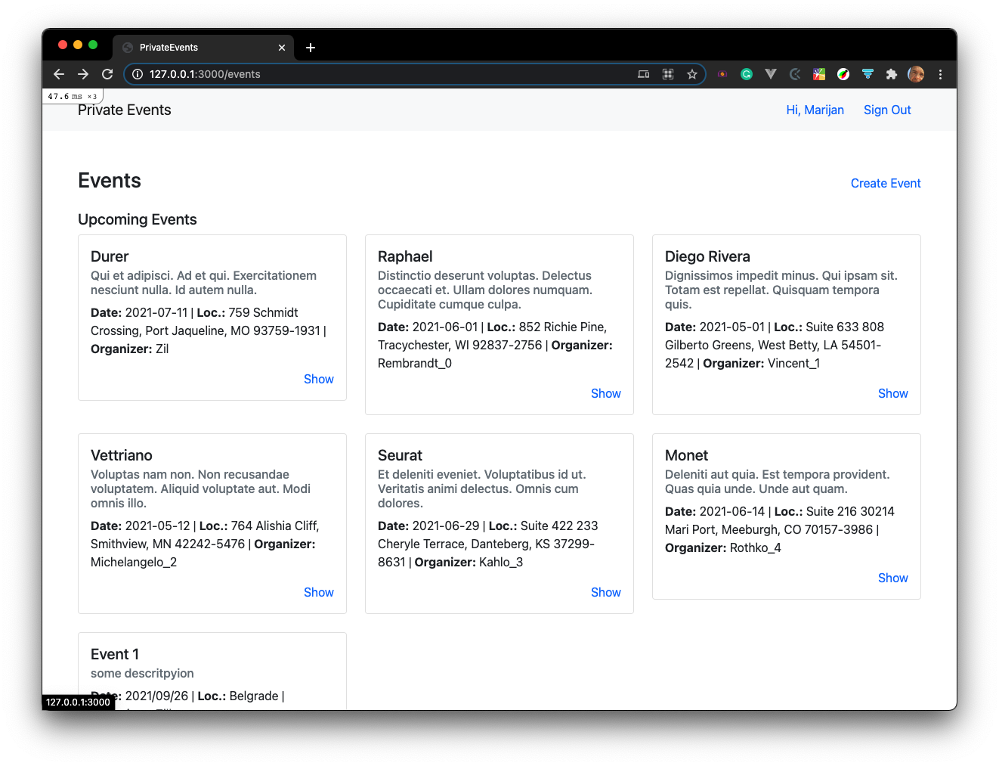

# Private events

> We are building a site similar to a private Eventbrite that allows users to create events and manage user signups. Users can create and attend events. Events take place at a specific date and a location.  A user can create events. A user can participate in many events. Many users can attend an event. This will require you to model many-to-many relationships.

Additional description of the project and its features.

## Built With

- Ruby
- Ruby on Rails

### Setup

- To use the application, please clone the repository to your local computer `git clone git@github.com:marijanbrvar/private-events.git` then cd to directory `cd private events
- Use `bundler` to receive gems required for this project
- Run `rails db:setup` to create the database, run migration files, and install some sample data
- Activate your rails server by running the command `rails s`

### Usage
- Open the application in your browser. Usually, it is at `http://localhost:3000/`
- Sign up for a new user account and create a new event
- to check existing data, click on the 'SHOW' link at the first event.

## AUTHOR

**Zil Norvilis**

- Github: 
- Linkedin: 
- Twitter: 

**MARIJAN BRVAR**

- GitHub: [@githubhandle](https://github.com/marijanbrvar)
- Twitter: [@twitterhandle](https://twitter.com/marijanbrvar)
- LinkedIn: [LinkedIn](https://linkedin.com/in/marijanbrvar)

## 🤝 Contributing

Contributions, issues, and feature requests are welcome!

Feel free to check the [issues page](https://github.com/marijanbrvar/private-events/issues).

## Show your support

Give a ⭐️ if you like this project!

## Acknowledgments

- Hat tip to anyone who's code was used
- Inspiration
- etc

## 📝 License

- This project is [MIT](https://github.com/marijanbrvar/private-events/blob/development/LICENSE) licensed.
- This project is [creativecommons](https://creativecommons.org/licenses/by-nc/4.0/) licensed.
